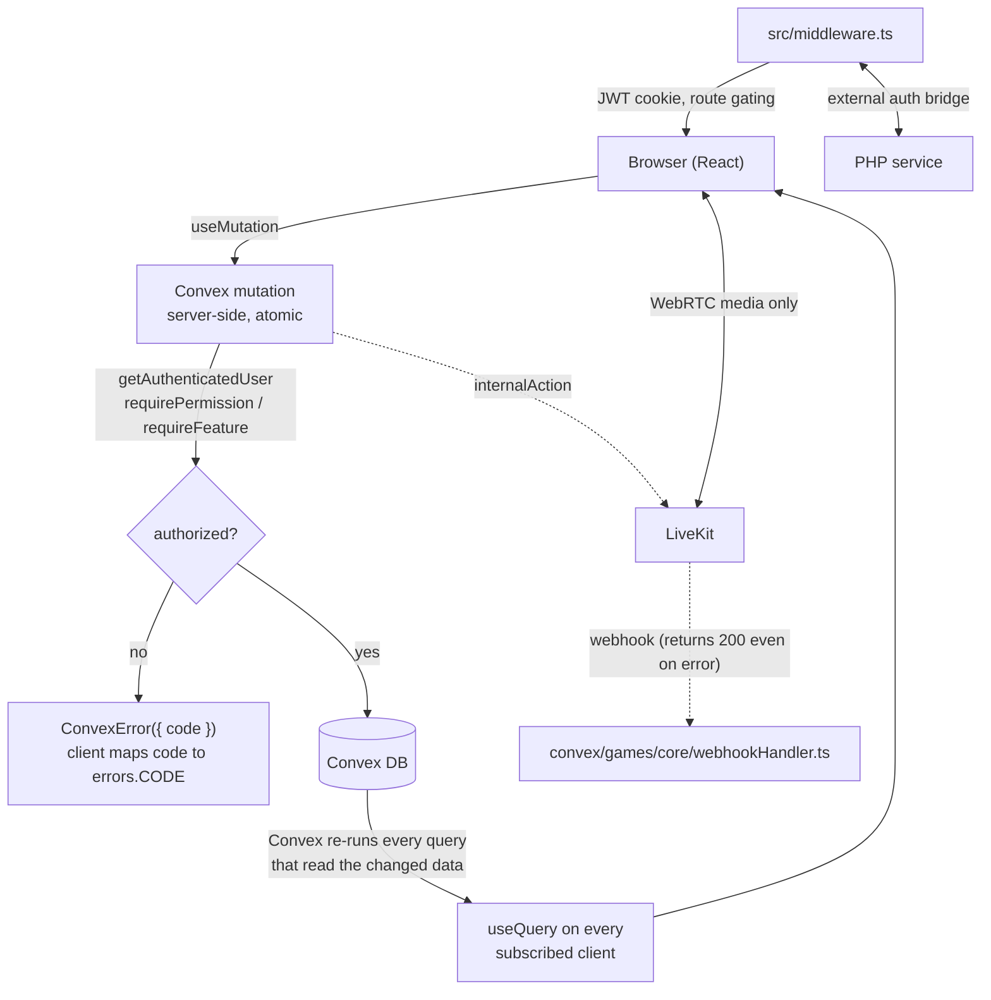

# Architecture

## Stack Overview

### Frontend

- **Framework**: Next.js 15 with App Router
- **UI Library**: React 19
- **Styling**: TailwindCSS 4 + shadcn/ui components
- **State Management**: Convex reactive queries + local component state (no Redux/global store)
- **Forms**: React Hook Form + Zod validation
- **Icons**: Lucide React

### Backend

- **Database & Server Functions**: Convex (document DB + mutations/queries)
- **Authentication**: custom JWT bridge to an external PHP service (`convex/lib/auth.ts`; **not** `@convex-dev/auth` — see ADR-006, superseded)
- **Real-time**: Convex reactive queries (guaranteed consistency)
- **Video/Audio**: LiveKit (WebRTC via LiveKit Server SDK)
- **Webhooks**: Next.js API Routes (LiveKit webhooks)

### Development

- **TypeScript**: Strict mode enabled
- **Linting**: ESLint with Next.js config
- **Type Generation**: Automatic via Convex (`convex/_generated/`)

## System Boundaries

### Client (Browser)

- React components and UI rendering
- Local state management (`useState`)
- Convex reactive queries (`useQuery` for real-time data)
- Convex mutations (`useMutation` for writes)
- LiveKit client (video/audio streaming)
- Form handling and validation

### Server (Convex)

- All game logic and state transitions (mutations)
- Database reads with access control (queries)
- Authentication via `getAuthenticatedUser(ctx)`
- Role-based data filtering
- External API calls via `internalAction` (LiveKit token generation)

### Server (Next.js)

- Page routing and SSR
- Middleware for auth route protection
- API routes for webhooks (LiveKit)

### Data Flow

The reactive loop is the thing to internalise: a client never re-fetches. It
subscribes, and Convex re-runs the affected queries when the data they read
changes.



Three things this encodes that are easy to get wrong:

- **No manual subscriptions and no `useEffect` for data.** `useQuery` *is* the
  subscription; Convex decides what to re-run.
- **Authorization is server-side and authoritative.** Route gating in middleware
  and the `/admin` layout is UX; the Convex check is the real one.
- **The LiveKit webhook returns 200 even when it fails** — a break there is
  invisible. It is one of the paths `tests/convex/apiIntegrity.test.ts` exists to
  protect.

## Directory Structure

```
convex/                          # All backend logic (deployed to Convex)
├── _generated/                  # Auto-generated types and API (DO NOT EDIT)
├── schema.ts                    # Database schema (imports tables/)
├── tables/                      # Table definitions (imported by schema.ts)
├── auth.config.ts               # Auth provider config (custom JWT bridge)
├── convex.config.ts             # Convex components config (presence, etc.)
├── auth/                        # Auth queries/mutations (profiles)
├── lobby/                       # Lobby: games CRUD, join requests, host transfer
├── games/                       # Game engine, split by variant
│   ├── core/                    #   shared engine (players, roles, sessions,
│   │                            #   dayPhase, nightPhase, voting, farewellSpeech)
│   ├── japanese/                #   Japanese Mafia variant (definition, phases)
│   ├── sports/                  #   Sports Mafia variant (definition, phases)
│   └── registry.ts              #   variant registry (getGameDefinition)
├── admin/                       # Admin/moderator queries (users, games, stats)
├── community/                   # Community chat (messages, read state)
├── crons.ts                     # Scheduled jobs (community prune, etc.)
├── presence.ts                  # Presence component wiring
├── migrations.ts                # One-off data migrations
├── lib/                         # Shared helpers (auth, access, constants, ratings)
└── refs/                        # makeFunctionReference wrappers (TS2589 workaround)

src/
├── app/                         # Next.js App Router pages (thin wrappers only)
│   ├── api/                     # API routes (LiveKit webhook, auth bridge)
│   ├── (headquarters)/          # Lobby, leaderboard, match history, subscriptions
│   ├── game/[id]/               # Game room page
│   └── layout.tsx               # Root layout (providers)
│
├── features/                    # Feature-first UI + hooks + feature-local lib
│   ├── admin/                   # Admin panel + analytics dashboard
│   ├── auth/                    # Auth components, hooks, middleware, JWT bridge
│   ├── game-room/               # The in-game experience (largest feature)
│   │   ├── components/          #   room/phase/actions/voting/participant/host/…
│   │   ├── context/             #   gameRoomContext (central room state)
│   │   ├── hooks/               #   game/participant/livekit hooks
│   │   ├── variants/            #   client rulesets: core/japanese/sports + registry
│   │   ├── assets/              #   role card PNGs
│   │   └── styles/              #   game.css
│   ├── headquarters/            # Authed shell: nav, community chat, match history
│   ├── landing/                 # Marketing landing page
│   ├── lobby/                   # Lobby content + room cards
│   └── subscriptions/           # Billing page + subscription config
│
├── providers/                   # App-level providers/bootstraps (Convex, ServerTime…)
├── i18n/                         # next-intl config
├── middleware.ts                # Next.js root middleware (composes auth middleware)
└── shared/                      # Cross-feature leaf modules (no upward deps)
    ├── ui/                      # Reusable UI primitives + icons
    ├── hooks/                   # Generic hooks (useInfiniteScroll)
    └── lib/                     # constants, game logic (visibility, speaking order),
                                 #   time (serverTime), env, livekit actions, cn, utils
```

## Key Architectural Patterns

### 1. Convex Mutations (Server-Side Logic)

All game state changes go through Convex mutations:

```typescript
// convex/gameSessions.ts
export const start = mutation({
  args: { gameId: v.id("games") },
  handler: async (ctx, args) => {
    const userId = await getAuthenticatedUser(ctx);
    if (!userId) throw new Error("Not authenticated");
    // Validate, update database
  },
});

// Frontend: useMutation(api.gameSessions.start)
```

### 2. Reactive Queries (Real-Time)

Convex `useQuery` provides guaranteed real-time sync:

```typescript
// Single line: fetches, subscribes, auto-updates, auto-cleans up
const gameSession = useQuery(api.gameSessions.getByGame, { gameId });
```

### 3. Type Safety

Use auto-generated Convex types:

```typescript
import { Doc, Id } from "@/convex/_generated/dataModel";

const game: Doc<"games"> = ...;
const gameId: Id<"games"> = ...;
```

### 4. Role-Based Data Filtering

Filter sensitive data in Convex queries (server-side):

```typescript
// convex/games/core/roles.ts - getFiltered query
// Returns roles filtered by team visibility
// Host sees all, teammates see each other, others see null
```

## Data Persistence

- **Primary Store**: Convex document database
- **Real-time Sync**: Convex reactive queries (guaranteed consistency)
- **No In-Memory State**: All game state is persisted in the database
- **Transactions**: Convex mutations are atomic (full success or full rollback)

## Authentication Flow

Identity is owned by the external PHP service (mafia.ge). This app has **no**
password/OTP login of its own, no `@convex-dev/auth`, and no `getAuthUserId` —
it bridges an existing PHP session into a Convex JWT.

### Signed-in path

1. **Detect.** `src/middleware.ts` composes
   `publicPageMiddleware → jwtCookieMiddleware → bridgeRedirectMiddleware`
   (first `stop` wins). A request already carrying the httpOnly `cnvx-auth`
   cookie passes straight through.
2. **Bridge.** A request with a `PHPSESSID` but no `cnvx-auth` is redirected to
   `src/app/api/auth/bridge/route.ts`, which calls PHP's `user-by-session`
   endpoint, signs a Convex JWT, and sets it as `cnvx-auth`.
3. **Sync.** Once Convex reports authenticated, `ProfileSyncBootstrap` POSTs
   `src/app/api/auth/sync-profile/route.ts` to upsert the `profiles` row.
   Between steps 2 and 3 the JWT is valid but the profile row does not exist yet.
4. **Authorize.** Convex functions call `getAuthenticatedUser(ctx)` and gate with
   `requirePermission` / `requireFeature` — the only authoritative layer
   ([authorization.md](./authorization.md)).

Silent re-validation uses the same exchange without a navigation:
`src/app/api/auth/token/refresh/route.ts`.

### Guest access

Unauthenticated visitors may READ a small set of product pages. Three route
categories, all declared in `convex/lib/access.ts`:

| Category | Runs the bridge? | Terminal verdict |
| --- | --- | --- |
| `PUBLIC_PATH_PREFIXES` — infra (`/api/auth/*`, `/_next/*`, auth screens) | no — short-circuits the chain | render |
| `GUEST_VIEWABLE_PATHS` — `/`, `/lobby`, `/leaderboard` | **yes** | render read-only |
| everything else | yes | redirect to `/auth/required` |

The distinction is load-bearing: a public prefix skips the bridge entirely, so
putting a product page there would leave a logged-in mafia.ge user rendering as a
guest permanently. Guest-viewable paths still bridge — they only change the
verdict when bridging finds no user.

`/game/*` is deliberately absent: that is the "no spectating for guests"
guarantee, enforced at the edge.

### Four viewer states

`useViewer()` (`src/features/auth/hooks/useViewer.ts`) is the client-side
primitive. Convex `useQuery` returns `undefined` while loading, and
`currentProfile` returns `null` for **both** a guest and an authenticated user
whose profile row has not landed yet — so `if (!profile)` is always a bug.

| status | meaning |
| --- | --- |
| `loading` | query in flight — wait |
| `syncing` | JWT valid, profile row not written yet — wait |
| `guest` | terminal — render guest UI |
| `member` | settled |

Only `guest` is terminal. Any `useQuery` whose handler calls
`getAuthenticatedUser` must pass `"skip"` unless `viewer.isMember`.

### The `bridge_attempted` invariant

`bridge_attempted` is a short-lived cookie caching the verdict *"this PHPSESSID
has no user"*, so a browsing guest does not re-hit PHP on every navigation.
Without it, guest page → middleware → bridge → guest page loops forever.

**Anything that sends the user to mafia.ge login must clear it first.** Logging in
is precisely the event that falsifies the cached verdict, and the round trip is
far shorter than the cookie's TTL — so a stale marker makes the middleware skip
the very bridge that would have succeeded, and the user returns authenticated but
is rendered as a guest.

That is why UI sign-in links point at `src/app/api/auth/login/route.ts` (via
`loginStartUrl` in `src/features/auth/lib/phpLogin.ts`) instead of straight at
mafia.ge: a plain `<a>` cannot clear an httpOnly cookie.

## Deployment

- **Frontend**: Vercel (Next.js deployment)
- **Backend + Database**: Convex (managed service)
- **Video**: LiveKit (self-hosted or cloud)
- **Environment Variables**: `NEXT_PUBLIC_CONVEX_URL`, `NEXT_PUBLIC_ENVIRONMENT`
  (selects the PHP base URL), `NEXT_PUBLIC_ONLINE_MAFIA_ORIGIN`,
  `INTERNAL_API_KEY` + `CONVEX_JWT_ISSUER` (the PHP↔Convex bridge), LiveKit credentials
