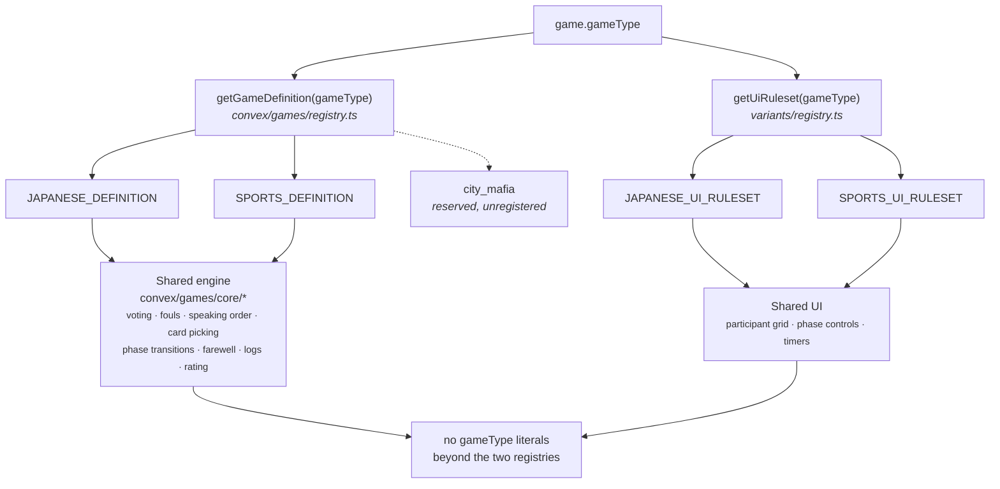

# Game Types — Multi-Variant Architecture

> Status: **Built.** Both registries ship — `convex/games/registry.ts`
> (`getGameDefinition`) on the backend and
> `src/features/game-room/variants/registry.ts` (`getUiRuleset`) on the
> frontend — with `japanese_mafia` and `sports_mafia` registered. Phases 1–5 all
> landed; the remaining work is listed in §5.
>
> This document is the source of truth for **how a variant is declared and
> dispatched**. It is deliberately the one doc under `docs/engine/` allowed to
> name variant-specific roles and phases, because comparing variants is its
> subject — see the exemption in `tests/structure/variantDocs.test.ts`.
>
> **Where the rules themselves live:**
>
> | | |
> | --- | --- |
> | Shared win-check mechanism | [engine/win-check-seam.md](./win-check-seam.md) |
> | Japanese rules | [variants/japanese/rules.md](../variants/japanese/rules.md), [win-conditions.md](../variants/japanese/win-conditions.md) |
> | Sports rules | [variants/sports.md](../variants/sports.md) |

## 1. The problem (historical)

> Kept because `convex/games/japanese/phases.ts` and
> `variants/japanese/phaseFlow.ts` cite §1 for *why* they exist. The
> condition it describes is **fixed**.

The app was built for a single variant and the ruleset was hardwired end to
end: no dispatch layer, nothing in the render path or the phase engine
consulted `gameType`, and phases were referenced **positionally**
(`GAME_PHASES[3]`). A second variant would have meant either forking half the
codebase or threading `if (gameType === ...)` through dozens of files.

Every concern that was hardwired — phase list, role deck, teams, night kill
model, kill resolution, win detection, role deal, right-hand promotion, seat
geometry — now resolves through one of the two registries in §2. The current
per-variant values are generated into
[generated/game-spec.md](../generated/game-spec.md); this section deliberately
does not restate them.

## 2. The design: a Game Definition registry

Introduce a single abstraction — a **`GameDefinition`** — that declares
everything variant-specific behind stable interfaces. Shared _engine_ code
(voting mechanics, speaking order, fouls, LiveKit, presence, card-picking,
archiving, ELO, broadcasts) stays **one implementation**. Only the variant
_rules_ are swapped, chosen once per game by `game.gameType`.



Two parallel registries, resolved once per game and read everywhere else. The
backend half owns the **rules**; the frontend half owns the **rendering
concerns** the rules do not cover — visibility, phase→controls map, seat
geometry, night authority, per-phase timers.

`city_mafia` is in the `GameType` union with no definition registered, so it
cannot be created. Registering it will fail the build until a doc for it exists
under `docs/variants/` — see `tests/structure/variantDocs.test.ts`.

### 2.1 The interface (backend)

A definition is **pure data + pure functions** (no `ctx.db`, no React), so it
imports cleanly into Convex functions, React, and node-environment tests
alike. This is the shipped shape — see `convex/games/core/types.ts`:

```ts
export interface GameDefinition {
  id: GameType;                      // "japanese_mafia" | "sports_mafia" | …
  seatCount: number;                 // seated non-host players

  roles: readonly Role[];            // every role this variant can assign
  roleDistribution: readonly Role[]; // the deck (length === seatCount)
  factions: readonly Faction[];
  roleToFaction: (role: Role) => Faction;
  teams: Record<string, readonly Role[]>;  // who meets / sees together

  phases: readonly Phase[];          // ordered phase ids for THIS variant
  /** Host-advance target, or null when the next phase depends on DB state. */
  nextPhase: (phase: Phase, ctx?: PhaseContext) => Phase | null;

  night: NightModel;                 // kind, actingRoles, resolveKills (§2.3)

  /** Decided outcome, or null to continue. */
  decideWinner: (aliveRoles: Role[], context: WinContext) => Outcome | null;
  /** Same decision plus a WinMethod snapshot for faction wins. */
  describeWin: (aliveRoles: Role[], context: WinContext) => WinMethod | "no_contest" | null;

  flags: GameFlags;                  // switches the shared engine reads
}
```

Two things live on the **UI** ruleset (§2.2) rather than here, because they
are rendering concerns: `visibility` and per-phase decision `timers`. Do not
reach for `definition.visibility` — it does not exist.

Current field values for every registered variant are generated into
[generated/game-spec.md](../generated/game-spec.md).

Key point: **phase ids are strings, referenced by name, never by index.** The
positional `GAME_PHASES[3]` pattern was the single biggest source of coupling
and is replaced by `definition.nextPhase(...)`.

### 2.2 The registry

```ts
// convex/games/registry.ts
import { JAPANESE_DEFINITION } from "./japanese/definition";
import { SPORTS_DEFINITION } from "./sports/definition";

const DEFINITIONS = {
  japanese_mafia: JAPANESE_DEFINITION,
  sports_mafia: SPORTS_DEFINITION,
} as const;

export function getGameDefinition(gameType: string): GameDefinition {
  const def = DEFINITIONS[gameType as keyof typeof DEFINITIONS];
  if (!def) throw new ConvexError(`No game definition for "${gameType}"`);
  return def;
}
```

The frontend gets a **parallel** registry of UI rulesets (phase→controls map,
visibility, night-authority, seat layout) keyed the same way, resolved once in
`gameRoomContext` from `gameData.gameType` and passed down via context.

### 2.3 The night model — the deepest divergence

Japanese and Sports resolve night kills completely differently, so `NightModel`
is an interface, not a shared function:

- **Japanese** (`single-authority`): one kill authority per team picks one
  target; Doctor can save; two teams can kill. State: scalar
  `mafiaTarget` / `yakuzaTarget` / `healedPlayer`.
- **Sports** (`unanimous-vote`): every living mafia independently picks within a
  5s window; kill happens **iff all living mafia chose the same target**;
  otherwise no kill; a lone mafia may abstain. State: an **array** of per-mafia
  selections. No Doctor.

The night session table must therefore stop being Japanese-shaped. Two options:

1. **Add variant-specific optional fields** to `nightPhaseSessions` (e.g.
   `mafiaTargetSelections: {mafiaSeat, targetSeat}[]`) alongside the existing
   scalars. Lowest-risk; the shared cleanup/query code is unchanged. Preferred
   for the first extra variant.
2. **Generalize** to a `nightActions` sub-document keyed by action type. Cleaner
   long-term; larger blast radius. Defer until a 3rd variant justifies it.

The `NightModel` owns: which roles act (`getActingRoles`), how a selection is
recorded (`recordSelection`), and how the night **resolves to killed seats**
(`resolveKills`) — the shared `startFarewellSpeech` calls `resolveKills` instead
of reading scalars directly.

### 2.4 Visibility

`src/shared/lib/game/visibility.ts` becomes a thin dispatcher that asks the variant's
`VisibilityRuleset` two questions the rest of the UI already needs:
`getAwakeRoles(phase)` and `canSeeParticipant(viewer, target, phase, state)`.
The Japanese literal chains move verbatim into `japanese/visibility.ts`; Sports
ships a smaller ruleset (no doctor/yakuza phases). The `VisibilityState`
enum and `getVisibilityStateWithDeath` layering stay shared.

## 3. Directory structure

This shipped. What follows is the tree as it exists, not a target.

```
convex/games/
  registry.ts            getGameDefinition(gameType) — the ONLY backend place
                         allowed to name a variant by string literal
  core/                  variant-agnostic engine + shared types
  japanese/              definition, phases, nightModel, winConditions
  sports/                the same, plus roles.ts and bestMove.ts

src/features/game-room/variants/
  registry.ts            getUiRuleset(gameType)
  core/types.ts          UiRuleset and friends
  japanese/              visibility, phaseFlow, phaseControls, seatLayout,
  sports/                nightAuthority, nightActionsDisplay, ruleset
```

Two asymmetries are real and intentional, not oversights:

- Japanese has no `roles.ts`. Its deck and team constants still live in
  `convex/lib/constants.ts`; Sports owns its own. Closing that gap is the
  first item in §5's remaining work.
- Only Sports has `bestMove.ts`, because only Sports has the mechanic.

For the wider layout see [architecture.md](../architecture.md).

## 4. Shared vs variant-specific — the split

**Stays shared (one implementation, reads the definition):**

- Card-picking flow & watchdog — deck = `def.roleDistribution`; the auto-pick,
  turn timer, and OCC logic are variant-agnostic.
- Speaking order & timers (`computeSpeakingOrder`, `getNextSpeaker`), day-speech
  and self-justification speaking controls.
- Voting mechanics (windows, auto-vote on last candidate, tie-break, both-leave)
  — the **flow** is shared; per-variant _rules_ (day-1 single-nominee handling)
  are flags on the definition.
- Fouls (counting, foul-speak 5s, elimination on the Nth) — the threshold and
  the **speaking-ban consequence** are variant flags.
- Farewell speech flow; phase-transition helpers; LiveKit; presence; broadcasts;
  game logs + ELO; admin analytics; match history; leaderboard.

**Becomes variant-specific (lives in the definition / variant folder):**

- Phase list and the transition graph (`nextPhase`).
- Role set, deck, factions, `roleToFaction`, team membership.
- Night model (who acts, how selections record, how kills resolve).
- Win detection.
- Visibility ruleset + awake roles.
- Host phase-controls map (which button per phase).
- Seat layout geometry (12-ring vs 10-ring).
- Special mechanics: right-hand promotion (Japanese), 3rd-foul speaking ban
  (Sports), day-1 single-nominee rule (Sports).

## 5. Phased refactor plan (complete)

> All six phases landed. Kept as the record of how the abstraction was
> introduced without destabilising the live Japanese game — the sequencing is
> the reusable part. Task-level detail is archived at
> [archive/game-types-refactor-2026-08.md](../archive/game-types-refactor-2026-08.md).

- **Phase 0 — Rename.** `traditional → sports_mafia` across the schema
  validator, `RATING_CONFIG`, `refs/*`, frontend constants, i18n and docs. The
  legacy literal was dropped outright; no deployment held `traditional` rows,
  so no data migration was needed (§7).
- **Phase 1 — Introduce the abstraction, extract Japanese.** Defined
  `GameDefinition` and the `NightModel` / `VisibilityRuleset` interfaces, moved
  the Japanese rules behind them, and replaced the positional
  `GAME_PHASES[n]` transitions with `definition.nextPhase(...)`. Byte-for-byte
  equivalent behaviour, guarded by the characterization suite.
- **Phase 2 — Author the Sports definition (data only).** Roles, deck, two
  factions, phase list, parity `decideWinner`, flags. Nothing wired to the UI.
- **Phase 3 — Sports night model + new mechanics.** Added
  `mafiaTargetSelections` to `nightPhaseSessions`, implemented the
  unanimous-vote `NightModel`, and added the third-foul speaking ban and the
  day-1 single-nominee rule as shared-engine behaviour gated on flags.
- **Phase 4 — Frontend dispatch + geometry.** `gameRoomContext` resolves the
  UI ruleset from `gameData.gameType`; `GamePhaseControls` renders from the
  variant's phase→controls map; visibility and night-authority dispatch
  through the ruleset. Fixed the `maxPlayers` plumbing (§6) and added the
  10-seat layout.
- **Phase 5 — Enable.** `sports_mafia` un-filtered in `CreateGameModal` and
  shipped **unrated** (absent from `RATING_CONFIG` → rating skipped).

### Remaining work

Everything above has landed. Two items are still open, lifted here from the
archived task tracker so this is the only place they live:

- **Japanese roles and constants have not moved into the variant folder.**
  `convex/games/japanese/definition.ts` still imports
  `JAPANESE_MAFIA_ROLE_DISTRIBUTION`, `MAFIA_TEAM_ROLES`, `YAKUZA_TEAM_ROLES`
  and `GAME_PHASES` from `convex/lib/constants.ts`, and `roleToFaction` from
  `convex/lib/roles.ts`. Sports already owns its equivalents in
  `convex/games/sports/roles.ts`, so the two variants are asymmetric. This is a
  mechanical move guarded by `tests/game/gameDefinition.test.ts` — import paths
  change, values must not.

- **Sports is intentionally unrated.** `RATING_CONFIG` in
  `convex/lib/constants.ts` has only a `japanese_mafia` entry; a missing entry
  means ELO is skipped entirely. Add the Sports config and E-table once ~200
  decided Sports games exist (see [ranking-system.md](../ranking-system.md) §9).

## 6. Seat geometry

> Was titled "latent bug to fix in Phase 4: `maxPlayers` is never plumbed".
> Fixed. The heading is cited from `variants/*/seatLayout.ts` and
> `variants/core/types.ts`, so it keeps its number.

Ring geometry is per-variant and comes from `ruleset.seatLayout`, never from a
hardcoded grid:

- `cols` / `rows` — grid template. Japanese is 4×4 for 12 seats; Sports 4×3
  for 10.
- `positionForSeat(seat)` — the ring cell for a 1-based seat.
- `center` — the region the host and controls occupy. Japanese **merges** host
  video and controls into one panel; Sports **splits** them into `hostPanel`
  and `controlsPanel`. When both split fields are set the renderer uses the
  split layout, otherwise it falls back to the merged panel.

`maxPlayers` is now derived from `definition.seatCount` rather than defaulting
to 12, so a Sports room no longer renders a 12-seat ring.

## 7. Data & migration notes

- **Legacy `"traditional"` rows — none exist, literal removed.** The type was
  never creatable in the UI, and there are no `traditional` rows in any
  deployment, so the literal was dropped from the `gameType` validator outright
  (no data migration). Convex validates existing documents against the schema at
  deploy time: if a stray `traditional` row ever did exist, the deploy would
  **fail with a clear "document does not match validator" error** (nothing is
  corrupted) — that error is the signal to reintroduce a one-shot rename
  migration (recoverable from git history) before retrying.
- **`winMethod` snapshot.** `tables/gameLogs.ts` → `winMethodValidator` carries
  `yakuzaAlive` / `shogunAlive`. Sports has neither faction; it should populate
  them `false` (backward-compatible) until `winMethod` is generalized. The
  `gameSessions.winner` union already includes `citizens` and `mafia`, which are
  the only outcomes Sports emits — no schema change needed there.
- **ELO ladders are per-`gameType`** (`playerRatings.by_gameType_rating`), so a
  Sports ladder is automatically separate from Japanese once a `RATING_CONFIG`
  entry is added. No cross-contamination.

## 8. Guardrails

- **No `gameType` string literals** in shared engine or shared UI after Phase 1
  — only the registry and the definitions may name a variant.
- **Phases by name, never by index.** Delete every `GAME_PHASES[n]` reference in
  favor of `definition.phases` / `definition.nextPhase`.
- **Definitions are pure.** No `ctx.db` in a definition — they take state in and
  return decisions out, so the same module is safe on client and server and is
  unit-testable in isolation.
- **Japanese is the regression oracle.** Every phase of the refactor is
  validated by the Japanese game behaving identically; only then is Sports wired
  in. This is enforced concretely by the characterization suite in `tests/`
  (see [testing.md](../testing.md)): when modules move, update only the import
  paths — never the assertions. A forced assertion change is a real regression,
  not a refactor. CI runs it on every push.
