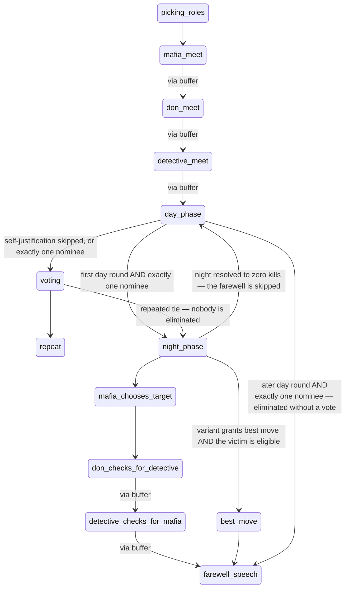
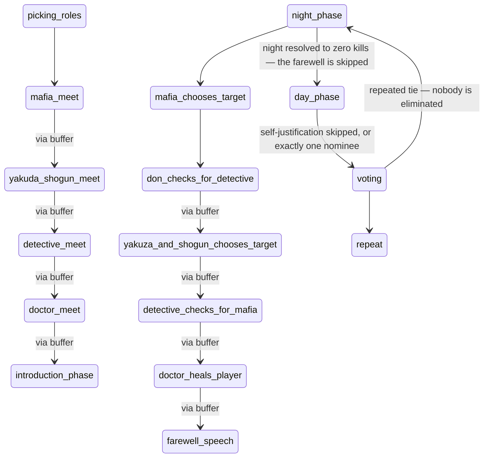

<!-- DO NOT EDIT — generated from the game definitions. -->

# Game Spec (generated)

> **DO NOT EDIT THIS FILE.** It is generated from the code and rewritten in
> place; a hand edit is discarded by the next run.
>
> Regenerate: `npm run docs:generate` · Verify: `npm run docs:check`
> (`npm test` also fails on drift, so CI catches a stale file.)
>
> Derived from `convex/games/registry.ts` and each variant's definition,
> plus the UI leaf modules `variants/<id>/{phaseFlow,visibility}.ts`.
> Everything iterates the registry, so a newly registered variant appears
> here automatically.
>
> **This file is the authority on roles, decks, phase order and win
> conditions.** Where a hand-written doc disagrees with it, the hand-written
> doc is wrong.

## Variants

| | `sports_mafia` | `japanese_mafia` |
| --- | --- | --- |
| Seats | 10 | 12 |
| Roles | 4 | 7 |
| Deck size | 10 | 12 |
| Factions | mafia, citizens | mafia, yakuza, citizens |
| Phases | 17 | 19 |
| Night model | `unanimous-vote` | `single-authority` |
| `firstDaySingleNomineeSkipsToNight` | yes | — |
| `hasBestMove` | yes | — |
| `hasFarewellSpeech` | yes | yes |
| `hasIntroductionPhase` | — | yes |
| `thirdFoulSpeakingBan` | yes | — |

## Roles

### `sports_mafia`

| Role | In deck | Faction | Acts at night |
| --- | --- | --- | --- |
| `DON` | ×1 | mafia | yes |
| `MAFIA` | ×2 | mafia | yes |
| `DETECTIVE` | ×1 | citizens | yes |
| `CITIZEN` | ×6 | citizens | — |

Deck is 10 cards for 10 seats.

### `japanese_mafia`

| Role | In deck | Faction | Acts at night |
| --- | --- | --- | --- |
| `DON` | ×1 | mafia | yes |
| `MAFIA` | ×2 | mafia | yes |
| `SHOGUN` | ×1 | yakuza | yes |
| `YAKUZA` | ×1 | yakuza | yes |
| `DETECTIVE` | ×1 | citizens | yes |
| `CITIZEN` | ×5 | citizens | — |
| `DOCTOR` | ×1 | citizens | yes |

Deck is 12 cards for 12 seats.

## Phases

### `sports_mafia`

| # | Phase | Label | Timer | Awake | Host advances to | Via buffer |
| --- | --- | --- | --- | --- | --- | --- |
| 1 | `game_session_started` | Game Started | — | — | server-owned | — |
| 2 | `picking_roles` | Picking Roles | — | — | `mafia_meet` | — |
| 3 | `mafia_meet` | Mafia Meeting | 60s | `DON` `MAFIA` | `don_meet` | yes |
| 4 | `don_meet` | Don Meeting | — | `DON` | `detective_meet` | yes |
| 5 | `detective_meet` | Detective Meeting | 15s | `DETECTIVE` | `day_phase` | yes |
| 6 | `day_phase` | Day Phase | — | — | server-owned | — |
| 7 | `nominated_players_speak` | Self-Justification | — | — | server-owned | — |
| 8 | `voting` | Voting | — | — | `repeat` | — |
| 9 | `night_phase` | Night Phase | — | — | `mafia_chooses_target` | — |
| 10 | `mafia_chooses_target` | Mafia Chooses Target | 20s | `DON` `MAFIA` | `don_checks_for_detective` | — |
| 11 | `don_checks_for_detective` | Don Checks for Detective | 15s | `DON` | `detective_checks_for_mafia` | yes |
| 12 | `detective_checks_for_mafia` | Detective Checks for Mafia | 15s | `DETECTIVE` | `farewell_speech` | yes |
| 13 | `best_move` | Best Move | 30s | — | `farewell_speech` | — |
| 14 | `farewell_speech` | Farewell Speech | — | — | server-owned | — |
| 15 | `repeat` | Next Round | — | — | server-owned | — |
| 16 | `end_game` | Game Over | — | — | server-owned | — |
| 17 | `phase_transition` | Everyone Asleep | — | — | server-owned | — |

`server-owned` means `nextPhase` returns null: the next phase depends on
database state, so a Convex mutation decides it. Those edges are listed
under **Branching edges** below.

### `japanese_mafia`

| # | Phase | Label | Timer | Awake | Host advances to | Via buffer |
| --- | --- | --- | --- | --- | --- | --- |
| 1 | `game_session_started` | Game Started | — | — | server-owned | — |
| 2 | `picking_roles` | Picking Roles | — | — | `mafia_meet` | — |
| 3 | `mafia_meet` | Mafia Meeting | 60s | `DON` `MAFIA` | `yakuda_shogun_meet` | yes |
| 4 | `yakuda_shogun_meet` | Yakuza & Shogun Meeting | 40s | `YAKUZA` `SHOGUN` | `detective_meet` | yes |
| 5 | `detective_meet` | Detective Meeting | 15s | `DETECTIVE` | `doctor_meet` | yes |
| 6 | `doctor_meet` | Doctor Meeting | 15s | `DOCTOR` | `introduction_phase` | yes |
| 7 | `introduction_phase` | Introduction | — | — | server-owned | — |
| 8 | `night_phase` | Night Phase | — | — | `mafia_chooses_target` | — |
| 9 | `mafia_chooses_target` | Mafia Chooses Target | 20s | `DON` `MAFIA` | `don_checks_for_detective` | — |
| 10 | `don_checks_for_detective` | Don Checks for Detective | 15s | `DON` | `yakuza_and_shogun_chooses_target` | yes |
| 11 | `yakuza_and_shogun_chooses_target` | Yakuza & Shogun Choose Target | 20s | `YAKUZA` `SHOGUN` | `detective_checks_for_mafia` | yes |
| 12 | `detective_checks_for_mafia` | Detective Checks for Mafia | 15s | `DETECTIVE` | `doctor_heals_player` | yes |
| 13 | `doctor_heals_player` | Doctor Heals | 15s | `DOCTOR` | `farewell_speech` | yes |
| 14 | `farewell_speech` | Farewell Speech | — | — | server-owned | — |
| 15 | `day_phase` | Day Phase | — | — | server-owned | — |
| 16 | `nominated_players_speak` | Self-Justification | — | — | server-owned | — |
| 17 | `voting` | Voting | — | — | `repeat` | — |
| 18 | `repeat` | Next Round | — | — | server-owned | — |
| 19 | `end_game` | Game Over | — | — | server-owned | — |

`server-owned` means `nextPhase` returns null: the next phase depends on
database state, so a Convex mutation decides it. Those edges are listed
under **Branching edges** below.

## Phase universe

Three phase lists exist and they are not the same length:
`convex/lib/constants.ts` (19),
`src/shared/lib/constants/game.ts` (22),
and each variant's own `definition.phases`.

| Phase | backend list | UI list | `sports_mafia` | `japanese_mafia` | verdict |
| --- | --- | --- | --- | --- | --- |
| `best_move` | — | yes | yes | — | variant-specific |
| `day_phase` | yes | yes | yes | yes | shared |
| `detective_checks_for_mafia` | yes | yes | yes | yes | shared |
| `detective_meet` | yes | yes | yes | yes | shared |
| `doctor_heals_player` | yes | yes | — | yes | variant-specific |
| `doctor_meet` | yes | yes | — | yes | variant-specific |
| `don_checks_for_detective` | yes | yes | yes | yes | shared |
| `don_meet` | — | yes | yes | — | variant-specific |
| `end_game` | yes | yes | yes | yes | shared |
| `farewell_speech` | yes | yes | yes | yes | shared |
| `game_session_started` | yes | yes | yes | yes | shared |
| `introduction_phase` | yes | yes | — | yes | variant-specific |
| `mafia_chooses_target` | yes | yes | yes | yes | shared |
| `mafia_meet` | yes | yes | yes | yes | shared |
| `night_phase` | yes | yes | yes | yes | shared |
| `nominated_players_speak` | yes | yes | yes | yes | shared |
| `phase_transition` | — | yes | yes | — | ⚠️ reachable in a flow that omits it |
| `picking_roles` | yes | yes | yes | yes | shared |
| `repeat` | yes | yes | yes | yes | shared |
| `voting` | yes | yes | yes | yes | shared |
| `yakuda_shogun_meet` | yes | yes | — | yes | variant-specific |
| `yakuza_and_shogun_chooses_target` | yes | yes | — | yes | variant-specific |

## State machine

Solid = derived from `definition.nextPhase`. Dotted = branch owned by a Convex mutation.

### `sports_mafia`

### `japanese_mafia`

## Win conditions

### `sports_mafia`

Every reachable alive-roster was enumerated and collapsed by the smallest
sufficient key. The key had to include **nothing beyond N and m** —
that is a derived result, not an assumption: those are exactly the roles
whose presence changes the answer.

`N` = alive players, `m` = alive mafia-faction players.
**0 of 32 rows disagree with naive parity** (`2m ≥ N`),
which is why a parity rule cannot be used as a shortcut.

| N | m | beforeNight | beforeDay | naive parity | ≠ |
| --- | --- | --- | --- | --- | --- |
| 0 | 0 | no_contest | no_contest | no_contest |  |
| 1 | 0 | citizens | citizens | citizens |  |
| 1 | 1 | mafia | mafia | mafia |  |
| 2 | 0 | citizens | citizens | citizens |  |
| 2 | 1 | mafia | mafia | mafia |  |
| 2 | 2 | mafia | mafia | mafia |  |
| 3 | 0 | citizens | citizens | citizens |  |
| 3 | 1 | continue | continue | continue |  |
| 3 | 2 | mafia | mafia | mafia |  |
| 3 | 3 | mafia | mafia | mafia |  |
| 4 | 0 | citizens | citizens | citizens |  |
| 4 | 1 | continue | continue | continue |  |
| 4 | 2 | mafia | mafia | mafia |  |
| 4 | 3 | mafia | mafia | mafia |  |
| 5 | 0 | citizens | citizens | citizens |  |
| 5 | 1 | continue | continue | continue |  |
| 5 | 2 | continue | continue | continue |  |
| 5 | 3 | mafia | mafia | mafia |  |
| 6 | 0 | citizens | citizens | citizens |  |
| 6 | 1 | continue | continue | continue |  |
| 6 | 2 | continue | continue | continue |  |
| 6 | 3 | mafia | mafia | mafia |  |
| 7 | 0 | citizens | citizens | citizens |  |
| 7 | 1 | continue | continue | continue |  |
| 7 | 2 | continue | continue | continue |  |
| 7 | 3 | continue | continue | continue |  |
| 8 | 1 | continue | continue | continue |  |
| 8 | 2 | continue | continue | continue |  |
| 8 | 3 | continue | continue | continue |  |
| 9 | 2 | continue | continue | continue |  |
| 9 | 3 | continue | continue | continue |  |
| 10 | 3 | continue | continue | continue |  |

### `japanese_mafia`

Every reachable alive-roster was enumerated and collapsed by the smallest
sufficient key. The key had to include `YAKUZA`, `SHOGUN`, `DOCTOR` —
that is a derived result, not an assumption: those are exactly the roles
whose presence changes the answer.

`N` = alive players, `m` = alive mafia-faction players.
**54 of 224 rows disagree with naive parity** (`2m ≥ N`),
which is why a parity rule cannot be used as a shortcut.

| N | m | YAKUZA | SHOGUN | DOCTOR | beforeNight | beforeDay | naive parity | ≠ |
| --- | --- | --- | --- | --- | --- | --- | --- | --- |
| 0 | 0 | — | — | — | no_contest | no_contest | no_contest |  |
| 1 | 0 | — | — | — | citizens | citizens | citizens |  |
| 1 | 0 | — | — | yes | citizens | citizens | citizens |  |
| 1 | 0 | — | yes | — | yakuza | yakuza | citizens | ⚠️ |
| 1 | 0 | yes | — | — | yakuza | yakuza | citizens | ⚠️ |
| 1 | 1 | — | — | — | mafia | mafia | mafia |  |
| 2 | 0 | — | — | — | citizens | citizens | citizens |  |
| 2 | 0 | — | — | yes | citizens | citizens | citizens |  |
| 2 | 0 | — | yes | — | yakuza | yakuza | citizens | ⚠️ |
| 2 | 0 | — | yes | yes | yakuza | yakuza | citizens | ⚠️ |
| 2 | 0 | yes | — | — | yakuza | yakuza | citizens | ⚠️ |
| 2 | 0 | yes | — | yes | yakuza | yakuza | citizens | ⚠️ |
| 2 | 0 | yes | yes | — | yakuza | yakuza | citizens | ⚠️ |
| 2 | 1 | — | — | — | mafia | mafia | mafia |  |
| 2 | 1 | — | — | yes | mafia | mafia | mafia |  |
| 2 | 1 | — | yes | — | yakuza | yakuza | mafia | ⚠️ |
| 2 | 1 | yes | — | — | yakuza | yakuza | mafia | ⚠️ |
| 2 | 2 | — | — | — | mafia | mafia | mafia |  |
| 3 | 0 | — | — | — | citizens | citizens | citizens |  |
| 3 | 0 | — | — | yes | citizens | citizens | citizens |  |
| 3 | 0 | — | yes | — | continue | continue | citizens | ⚠️ |
| 3 | 0 | — | yes | yes | continue | continue | citizens | ⚠️ |
| 3 | 0 | yes | — | — | continue | continue | citizens | ⚠️ |
| 3 | 0 | yes | — | yes | continue | continue | citizens | ⚠️ |
| 3 | 0 | yes | yes | — | yakuza | yakuza | citizens | ⚠️ |
| 3 | 0 | yes | yes | yes | yakuza | yakuza | citizens | ⚠️ |
| 3 | 1 | — | — | — | continue | continue | continue |  |
| 3 | 1 | — | — | yes | continue | continue | continue |  |
| 3 | 1 | — | yes | — | continue | continue | continue |  |
| 3 | 1 | — | yes | yes | continue | continue | continue |  |
| 3 | 1 | yes | — | — | continue | continue | continue |  |
| 3 | 1 | yes | — | yes | continue | continue | continue |  |
| 3 | 1 | yes | yes | — | yakuza | yakuza | continue | ⚠️ |
| 3 | 2 | — | — | — | mafia | mafia | mafia |  |
| 3 | 2 | — | — | yes | mafia | mafia | mafia |  |
| 3 | 2 | — | yes | — | mafia | mafia | mafia |  |
| 3 | 2 | yes | — | — | mafia | mafia | mafia |  |
| 3 | 3 | — | — | — | mafia | mafia | mafia |  |
| 4 | 0 | — | — | — | citizens | citizens | citizens |  |
| 4 | 0 | — | — | yes | citizens | citizens | citizens |  |
| 4 | 0 | — | yes | — | continue | continue | citizens | ⚠️ |
| 4 | 0 | — | yes | yes | continue | continue | citizens | ⚠️ |
| 4 | 0 | yes | — | — | continue | continue | citizens | ⚠️ |
| 4 | 0 | yes | — | yes | continue | continue | citizens | ⚠️ |
| 4 | 0 | yes | yes | — | yakuza | yakuza | citizens | ⚠️ |
| 4 | 0 | yes | yes | yes | yakuza | yakuza | citizens | ⚠️ |
| 4 | 1 | — | — | — | continue | continue | continue |  |
| 4 | 1 | — | — | yes | continue | continue | continue |  |
| 4 | 1 | — | yes | — | continue | continue | continue |  |
| 4 | 1 | — | yes | yes | continue | continue | continue |  |
| 4 | 1 | yes | — | — | continue | continue | continue |  |
| 4 | 1 | yes | — | yes | continue | continue | continue |  |
| 4 | 1 | yes | yes | — | yakuza | yakuza | continue | ⚠️ |
| 4 | 1 | yes | yes | yes | continue | continue | continue |  |
| 4 | 2 | — | — | — | mafia | mafia | mafia |  |
| 4 | 2 | — | — | yes | mafia | mafia | mafia |  |
| 4 | 2 | — | yes | — | mafia | mafia | mafia |  |
| 4 | 2 | — | yes | yes | mafia | mafia | mafia |  |
| 4 | 2 | yes | — | — | continue | continue | mafia | ⚠️ |
| 4 | 2 | yes | — | yes | continue | continue | mafia | ⚠️ |
| 4 | 2 | yes | yes | — | yakuza | yakuza | mafia | ⚠️ |
| 4 | 3 | — | — | — | mafia | mafia | mafia |  |
| 4 | 3 | — | — | yes | mafia | mafia | mafia |  |
| 4 | 3 | — | yes | — | mafia | mafia | mafia |  |
| 4 | 3 | yes | — | — | mafia | mafia | mafia |  |
| 5 | 0 | — | — | — | citizens | citizens | citizens |  |
| 5 | 0 | — | — | yes | citizens | citizens | citizens |  |
| 5 | 0 | — | yes | — | continue | continue | citizens | ⚠️ |
| 5 | 0 | — | yes | yes | continue | continue | citizens | ⚠️ |
| 5 | 0 | yes | — | — | continue | continue | citizens | ⚠️ |
| 5 | 0 | yes | — | yes | continue | continue | citizens | ⚠️ |
| 5 | 0 | yes | yes | — | continue | continue | citizens | ⚠️ |
| 5 | 0 | yes | yes | yes | continue | continue | citizens | ⚠️ |
| 5 | 1 | — | — | — | continue | continue | continue |  |
| 5 | 1 | — | — | yes | continue | continue | continue |  |
| 5 | 1 | — | yes | — | continue | continue | continue |  |
| 5 | 1 | — | yes | yes | continue | continue | continue |  |
| 5 | 1 | yes | — | — | continue | continue | continue |  |
| 5 | 1 | yes | — | yes | continue | continue | continue |  |
| 5 | 1 | yes | yes | — | continue | continue | continue |  |
| 5 | 1 | yes | yes | yes | continue | continue | continue |  |
| 5 | 2 | — | — | — | continue | continue | continue |  |
| 5 | 2 | — | — | yes | continue | continue | continue |  |
| 5 | 2 | — | yes | — | continue | continue | continue |  |
| 5 | 2 | — | yes | yes | continue | continue | continue |  |
| 5 | 2 | yes | — | — | continue | continue | continue |  |
| 5 | 2 | yes | — | yes | continue | continue | continue |  |
| 5 | 2 | yes | yes | — | continue | continue | continue |  |
| 5 | 2 | yes | yes | yes | continue | continue | continue |  |
| 5 | 3 | — | — | — | mafia | mafia | mafia |  |
| 5 | 3 | — | — | yes | mafia | mafia | mafia |  |
| 5 | 3 | — | yes | — | mafia | mafia | mafia |  |
| 5 | 3 | — | yes | yes | mafia | mafia | mafia |  |
| 5 | 3 | yes | — | — | mafia | mafia | mafia |  |
| 5 | 3 | yes | — | yes | continue | mafia | mafia | ⚠️ |
| 5 | 3 | yes | yes | — | mafia | mafia | mafia |  |
| 6 | 0 | — | — | — | citizens | citizens | citizens |  |
| 6 | 0 | — | — | yes | citizens | citizens | citizens |  |
| 6 | 0 | — | yes | — | continue | continue | citizens | ⚠️ |
| 6 | 0 | — | yes | yes | continue | continue | citizens | ⚠️ |
| 6 | 0 | yes | — | — | continue | continue | citizens | ⚠️ |
| 6 | 0 | yes | — | yes | continue | continue | citizens | ⚠️ |
| 6 | 0 | yes | yes | — | continue | continue | citizens | ⚠️ |
| 6 | 0 | yes | yes | yes | continue | continue | citizens | ⚠️ |
| 6 | 1 | — | — | — | continue | continue | continue |  |
| 6 | 1 | — | — | yes | continue | continue | continue |  |
| 6 | 1 | — | yes | — | continue | continue | continue |  |
| 6 | 1 | — | yes | yes | continue | continue | continue |  |
| 6 | 1 | yes | — | — | continue | continue | continue |  |
| 6 | 1 | yes | — | yes | continue | continue | continue |  |
| 6 | 1 | yes | yes | — | continue | continue | continue |  |
| 6 | 1 | yes | yes | yes | continue | continue | continue |  |
| 6 | 2 | — | — | — | continue | continue | continue |  |
| 6 | 2 | — | — | yes | continue | continue | continue |  |
| 6 | 2 | — | yes | — | continue | continue | continue |  |
| 6 | 2 | — | yes | yes | continue | continue | continue |  |
| 6 | 2 | yes | — | — | continue | continue | continue |  |
| 6 | 2 | yes | — | yes | continue | continue | continue |  |
| 6 | 2 | yes | yes | — | continue | continue | continue |  |
| 6 | 2 | yes | yes | yes | continue | continue | continue |  |
| 6 | 3 | — | — | — | mafia | mafia | mafia |  |
| 6 | 3 | — | — | yes | mafia | mafia | mafia |  |
| 6 | 3 | — | yes | — | mafia | mafia | mafia |  |
| 6 | 3 | — | yes | yes | mafia | mafia | mafia |  |
| 6 | 3 | yes | — | — | continue | continue | mafia | ⚠️ |
| 6 | 3 | yes | — | yes | continue | continue | mafia | ⚠️ |
| 6 | 3 | yes | yes | — | continue | continue | mafia | ⚠️ |
| 6 | 3 | yes | yes | yes | continue | continue | mafia | ⚠️ |
| 7 | 0 | — | — | yes | citizens | citizens | citizens |  |
| 7 | 0 | — | yes | — | continue | continue | citizens | ⚠️ |
| 7 | 0 | — | yes | yes | continue | continue | citizens | ⚠️ |
| 7 | 0 | yes | — | — | continue | continue | citizens | ⚠️ |
| 7 | 0 | yes | — | yes | continue | continue | citizens | ⚠️ |
| 7 | 0 | yes | yes | — | continue | continue | citizens | ⚠️ |
| 7 | 0 | yes | yes | yes | continue | continue | citizens | ⚠️ |
| 7 | 1 | — | — | — | continue | continue | continue |  |
| 7 | 1 | — | — | yes | continue | continue | continue |  |
| 7 | 1 | — | yes | — | continue | continue | continue |  |
| 7 | 1 | — | yes | yes | continue | continue | continue |  |
| 7 | 1 | yes | — | — | continue | continue | continue |  |
| 7 | 1 | yes | — | yes | continue | continue | continue |  |
| 7 | 1 | yes | yes | — | continue | continue | continue |  |
| 7 | 1 | yes | yes | yes | continue | continue | continue |  |
| 7 | 2 | — | — | — | continue | continue | continue |  |
| 7 | 2 | — | — | yes | continue | continue | continue |  |
| 7 | 2 | — | yes | — | continue | continue | continue |  |
| 7 | 2 | — | yes | yes | continue | continue | continue |  |
| 7 | 2 | yes | — | — | continue | continue | continue |  |
| 7 | 2 | yes | — | yes | continue | continue | continue |  |
| 7 | 2 | yes | yes | — | continue | continue | continue |  |
| 7 | 2 | yes | yes | yes | continue | continue | continue |  |
| 7 | 3 | — | — | — | continue | continue | continue |  |
| 7 | 3 | — | — | yes | continue | continue | continue |  |
| 7 | 3 | — | yes | — | continue | continue | continue |  |
| 7 | 3 | — | yes | yes | continue | continue | continue |  |
| 7 | 3 | yes | — | — | continue | continue | continue |  |
| 7 | 3 | yes | — | yes | continue | continue | continue |  |
| 7 | 3 | yes | yes | — | continue | continue | continue |  |
| 7 | 3 | yes | yes | yes | continue | continue | continue |  |
| 8 | 0 | — | yes | yes | continue | continue | citizens | ⚠️ |
| 8 | 0 | yes | — | yes | continue | continue | citizens | ⚠️ |
| 8 | 0 | yes | yes | — | continue | continue | citizens | ⚠️ |
| 8 | 0 | yes | yes | yes | continue | continue | citizens | ⚠️ |
| 8 | 1 | — | — | yes | continue | continue | continue |  |
| 8 | 1 | — | yes | — | continue | continue | continue |  |
| 8 | 1 | — | yes | yes | continue | continue | continue |  |
| 8 | 1 | yes | — | — | continue | continue | continue |  |
| 8 | 1 | yes | — | yes | continue | continue | continue |  |
| 8 | 1 | yes | yes | — | continue | continue | continue |  |
| 8 | 1 | yes | yes | yes | continue | continue | continue |  |
| 8 | 2 | — | — | — | continue | continue | continue |  |
| 8 | 2 | — | — | yes | continue | continue | continue |  |
| 8 | 2 | — | yes | — | continue | continue | continue |  |
| 8 | 2 | — | yes | yes | continue | continue | continue |  |
| 8 | 2 | yes | — | — | continue | continue | continue |  |
| 8 | 2 | yes | — | yes | continue | continue | continue |  |
| 8 | 2 | yes | yes | — | continue | continue | continue |  |
| 8 | 2 | yes | yes | yes | continue | continue | continue |  |
| 8 | 3 | — | — | — | continue | continue | continue |  |
| 8 | 3 | — | — | yes | continue | continue | continue |  |
| 8 | 3 | — | yes | — | continue | continue | continue |  |
| 8 | 3 | — | yes | yes | continue | continue | continue |  |
| 8 | 3 | yes | — | — | continue | continue | continue |  |
| 8 | 3 | yes | — | yes | continue | continue | continue |  |
| 8 | 3 | yes | yes | — | continue | continue | continue |  |
| 8 | 3 | yes | yes | yes | continue | continue | continue |  |
| 9 | 0 | yes | yes | yes | continue | continue | citizens | ⚠️ |
| 9 | 1 | — | yes | yes | continue | continue | continue |  |
| 9 | 1 | yes | — | yes | continue | continue | continue |  |
| 9 | 1 | yes | yes | — | continue | continue | continue |  |
| 9 | 1 | yes | yes | yes | continue | continue | continue |  |
| 9 | 2 | — | — | yes | continue | continue | continue |  |
| 9 | 2 | — | yes | — | continue | continue | continue |  |
| 9 | 2 | — | yes | yes | continue | continue | continue |  |
| 9 | 2 | yes | — | — | continue | continue | continue |  |
| 9 | 2 | yes | — | yes | continue | continue | continue |  |
| 9 | 2 | yes | yes | — | continue | continue | continue |  |
| 9 | 2 | yes | yes | yes | continue | continue | continue |  |
| 9 | 3 | — | — | — | continue | continue | continue |  |
| 9 | 3 | — | — | yes | continue | continue | continue |  |
| 9 | 3 | — | yes | — | continue | continue | continue |  |
| 9 | 3 | — | yes | yes | continue | continue | continue |  |
| 9 | 3 | yes | — | — | continue | continue | continue |  |
| 9 | 3 | yes | — | yes | continue | continue | continue |  |
| 9 | 3 | yes | yes | — | continue | continue | continue |  |
| 9 | 3 | yes | yes | yes | continue | continue | continue |  |
| 10 | 1 | yes | yes | yes | continue | continue | continue |  |
| 10 | 2 | — | yes | yes | continue | continue | continue |  |
| 10 | 2 | yes | — | yes | continue | continue | continue |  |
| 10 | 2 | yes | yes | — | continue | continue | continue |  |
| 10 | 2 | yes | yes | yes | continue | continue | continue |  |
| 10 | 3 | — | — | yes | continue | continue | continue |  |
| 10 | 3 | — | yes | — | continue | continue | continue |  |
| 10 | 3 | — | yes | yes | continue | continue | continue |  |
| 10 | 3 | yes | — | — | continue | continue | continue |  |
| 10 | 3 | yes | — | yes | continue | continue | continue |  |
| 10 | 3 | yes | yes | — | continue | continue | continue |  |
| 10 | 3 | yes | yes | yes | continue | continue | continue |  |
| 11 | 2 | yes | yes | yes | continue | continue | continue |  |
| 11 | 3 | — | yes | yes | continue | continue | continue |  |
| 11 | 3 | yes | — | yes | continue | continue | continue |  |
| 11 | 3 | yes | yes | — | continue | continue | continue |  |
| 11 | 3 | yes | yes | yes | continue | continue | continue |  |
| 12 | 3 | yes | yes | yes | continue | continue | continue |  |

## Night model

### `sports_mafia`

Kind: `unanimous-vote`. Acting roles: `DON`, `MAFIA`, `DETECTIVE`.

| Night state | Resolves to seats |
| --- | --- |
| mafia only | nobody |
| mafia target healed | nobody |
| two factions, distinct targets | nobody |
| two factions, same target | nobody |
| nothing chosen | nobody |
| unanimous private picks | 4 |
| split private picks | nobody |

### `japanese_mafia`

Kind: `single-authority`. Acting roles: `DON`, `MAFIA`, `SHOGUN`, `YAKUZA`, `DETECTIVE`, `DOCTOR`.

| Night state | Resolves to seats |
| --- | --- |
| mafia only | 3 |
| mafia target healed | nobody |
| two factions, distinct targets | 3, 5 |
| two factions, same target | 3 |
| nothing chosen | nobody |
| unanimous private picks | nobody |
| split private picks | nobody |

## Branching edges (hand-authored)

These are the only entries in this file that are not derived. Their target
depends on database state, so `definition.nextPhase` returns null and a
Convex mutation decides. Each carries a guard string that must still appear
verbatim in its owning file — if a branch is moved or reshaped, the guard
test fails rather than this table quietly going stale.

| Variants | From | To | When | Owner |
| --- | --- | --- | --- | --- |
| `sports_mafia` | `day_phase` | `night_phase` | first day round AND exactly one nominee | `convex/games/core/dayPhase.ts` |
| `sports_mafia` | `day_phase` | `farewell_speech` | later day round AND exactly one nominee — eliminated without a vote | `convex/games/core/dayPhase.ts` |
| `japanese_mafia`, `sports_mafia` | `day_phase` | `voting` | self-justification skipped, or exactly one nominee | `convex/games/core/dayPhase.ts` |
| `japanese_mafia`, `sports_mafia` | `night_phase` | `day_phase` | night resolved to zero kills — the farewell is skipped | `convex/games/core/farewellSpeech.ts` |
| `sports_mafia` | `night_phase` | `best_move` | variant grants best move AND the victim is eligible | `convex/games/core/farewellSpeech.ts` |
| `japanese_mafia`, `sports_mafia` | `voting` | `night_phase` | repeated tie — nobody is eliminated | `convex/games/core/voting.ts` |
